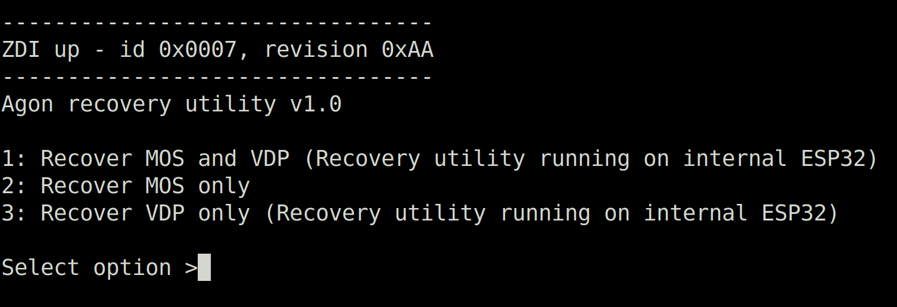

# Agon recovery utility
## Overview
This utility provides a means to (bare-metal) program MOS/VDP firmware to an AgonLight or Console8 system, in case the existing firmware becomes corrupted or has been erased. It is the sucessor to the agon-vdpflash and console-recover utilities.

The utility needs to be flashed to an ESP32, and connected to the target Agon system using a few jumper cables in order for **it** to program the required firmware.

## Utility ESP32 target
Depending on the Agon system, these are the options for flashing the utility to:
- AgonLight / AgonLight2 / AgonLight origins edition - For ease of use, the utility is best flashed to the internal ESP32 normally used for VDP.
- Console8 - Because the internal GPIO of the Console8 is lacking sufficient I/O ports, the utility needs to be flashed to an external ESP32. Most ESP32 devkits (with at least 4MB flash) will do fine for this purpose. If another AgonLight system is available, it can be used as a programmer to the Console8.

## Preparation
1. For AgonLight systems: connect two (dupont female-female) cables between the external GPIO and ZDI ports. Please see the [detailed description](#cabling-details).
2. For Console8: connect three (dupont) cables between the external ESP32 devkit/board and the internal Console8 ZDI port. Please see the [detailed description](#cabling-details).
3. Connect your Agon to a PC using a USB data cable. The type of USB cable may differ according to the Agon platform you're using:
    - the Olimex AgonLight2 has a USB-C type connector
    - the Agon Console8 has a USB-B type connector
    - the Agon Origins edition has a USB-B type connector
    - the original AgonLight(1) has a USB-A type connector
4. Find out which serial/COM port shows up on your PC, after connecting your Agon using a USB cable and note it down for later use:
    - Under Windows, it shows up in the 'Device Manager', or you can type '[System.IO.Ports.SerialPort]::getportnames()' in a PowerShell terminal
    - Under Linux, you can find it by running 'dmesg | grep tty' in a shell
    - Under MacOS, you can find it by running 'ls /dev/tty.*' in Terminal
5.For the Olimex AgonLight2 - please make sure the jumpers on the board are placed like this: the **LEFT** jumper is unconnected/open/placed on just one pin, the **RIGHT** jumper is connected/closed/placed on both pins

## Flashing the utility
Flashing the utility is best done using the [web programmer](https://envenomator.github.io/). If your browser is incompatible, follow the [documentation](https://github.com/envenomator/envenomator.github.io) from the web programmer to flash the utility using a commandline script or graphical tool.

## Usage
After flashing the utility to an ESP32, it presents the status of the ZDI interface and a menu if the connection is up.

The menu is presented on the USB/serial interface of the ESP32 (115200 baud / 8N1). If the utility is flashed to an AgonLight system, or ESP32 with similar VGA+PS2 connections, it presents the menu on-screen as well.

For AgonLight systems, having the utility flashed to the internal VDP, the best option to choose is (1) Recover MOS + VDP. 

For Console8 systems, having the utility flashed to an external ESP32, the only option is (2) Recover MOS. VDP needs to be recovered separately

After the utility is done programming firmware, physically reset the target Agon system.

## Cabling details
### ZDI connector

A GND cable is only required when using an external ESP32 to program the target Agon system.

### GPIO side (AgonLight variants only)
#### Original AgonLight GPIO header

Connects these cables to the ZDI port.

#### Olimex AgonLight2 GPIO IDC box header

Connects these cables to the ZDI port

### ESP32 devkit example

Other development boards may/will have pins placed differently, so be sure to check the layout of your particular board.

## Internals
Upon flashing the utility, a SPIFFS partition is prepopulated with a MOS.bin and a flash.bin. When programming MOS, both binaries are sent to the target ez80 system's memory using the ZDI interface and the flash.bin is executed remotely.

CRC32 of the MOS payload is checked at several stages:
1. Reading the MOS payload back from ez80 memory, after writing it
2. Reading the MOS payload back from ez80 flash, after the flash programmer has written it

The utility carries VDP firmware as secondary OTA payload, which the ESP32 switches to when the user selects the 'Recover VDP' or 'Recover MOS + VDP' option.

## Disclaimer
Having subjected my own gear multiple times to this utility, I feel it's safe for general use in recovering firmware. The responsibility for any issues during and/or after it's use, lies solely with the user of this utility